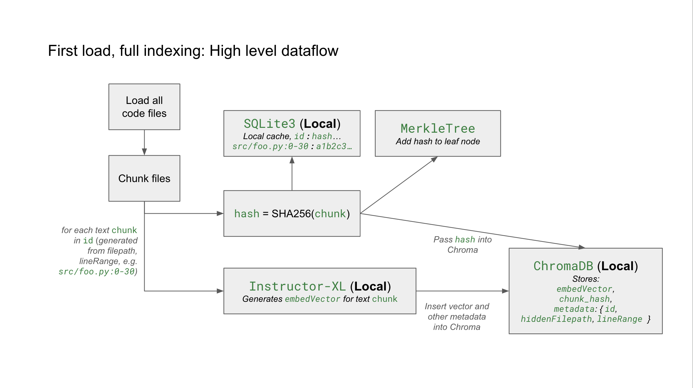
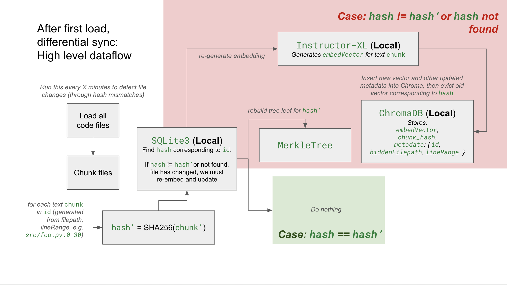
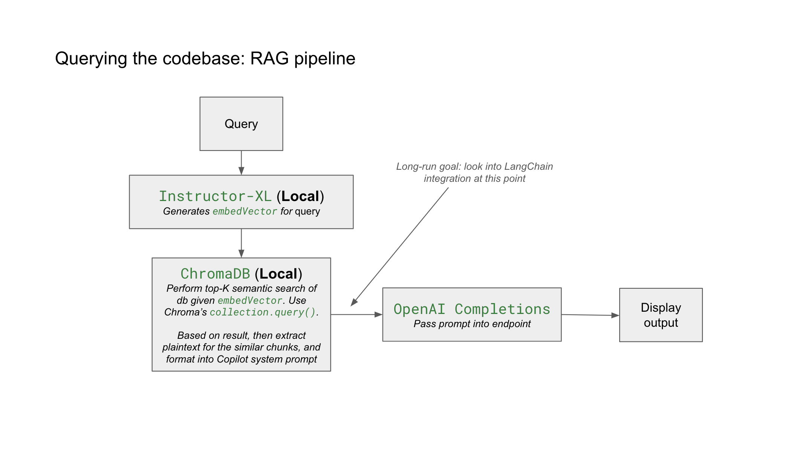

# Minipilot: A Maximally Private Copilot


## The Privacy-First Alternative to GitHub Copilot, Cursor, and More

Minipilot is a **local-first code assistant** that achieves **maximum possible privacy** by ensuring your codebase never leaves your machine. Unlike cloud-based alternatives, Minipilot provides intelligent code assistance while maintaining complete data sovereignty.

## Minipilot's Privacy is Architecturally Unique

### The Privacy Problem with Existing Solutions

Traditional code assistants like **GitHub Copilot** and **Cursor** require uploading your entire codebase to their servers for processing:

- **Cursor's Architecture** (in Privacy Mode): Uploads your full codebase → generates embeddings on their servers → deletes your code but retains embeddings → performs semantic search over the vectorized embeddings → retrieves relevant code chunks and sends to LLM → when session is over, embeddings are deleted
- **GitHub Copilot**: Not public, but likely similar and certainly requires a fully upload of codebase to some server, even if temporary, and continuously streams code context to GitHub's servers for real-time suggestions
- **The Upshot - Privacy Risks**: Your intellectual property passes through third-party infrastructure, creating potential security and compliance issues, **regardless of whether or not these providers retain your data**.

### Minipilot's Zero-Upload Architecture

Minipilot achieves the **theoretical minimum for LLM context sharing** - only the semantically relevant code chunks needed to answer your specific query:

```
Your Machine (Private)          Cloud (Minimal Exposure)
┌─────────────────────┐        ┌──────────────────────┐
│ Full Codebase       │        │ Only: Query +        │
│ ↓                   │   →    │ Relevant Chunks      │
│ Local Embeddings    │        │ (Few hundred lines   │
│ ↓                   │        │  at most)            │
│ Semantic Search     │        │                      │
│ ↓                   │        │ LLM Provider         │
│ Minimal Context     │        │ (OpenAI/Anthropic)   │
└─────────────────────┘        └──────────────────────┘
```

**Key Architectural Differences:**

1. **Local Processing**: All embeddings, indexing, and semantic search happen on your machine
2. **Minimal Exposure**: Only query + relevant code chunks (typically <1% of your codebase) reach the LLM
3. **No Persistence**: No embeddings or code stored on external servers
4. **Complete Control**: You decide what gets shared, when, and with whom

### Privacy Comparison

| Solution           | Codebase Upload     | Server-Side Processing | Data Retention                                                       | Privacy Level                                                                                                                     |
| ------------------ | ------------------- | ---------------------- | -------------------------------------------------------------------- | --------------------------------------------------------------------------------------------------------------------------------- |
| **GitHub Copilot** | Yes - Full upload   | Yes - Cloud processing | Only temporarily with privacy policy                                 | Requires user to trust provider                                                                                                   |
| **Cursor**         | Yes - Full upload   | Yes - Cloud processing | Only temporarily in privacy Mode                                     | Requires user to trust provider                                                                                                   |
| **Minipilot**      | No - Never uploaded | No - Local only        | No data is EVER in the hands of a third party. Not even temporarily. | The user IS the provider. No third party is ever involved in indexing. User's codebase is NEVER sent to any server for embedding. |

## Technical Architecture

### Core Components

- **Local Embeddings**: Uses `instructor-xl` model for code understanding (runs entirely offline)
- **Vector Database**: ChromaDB for fast semantic search of your code
- **Intelligent Chunking**: Context-aware code segmentation with overlap handling
- **Merkle Tree Change Detection**: Efficient incremental updates using cryptographic hashing
- **Web Interface**: Clean localhost interface for querying your codebase

### How It Works

1. **Indexing**: Scans your codebase and creates local embeddings
2. **Query Processing**: When you ask a question, embeds your query locally
3. **Semantic Search**: Finds most relevant code chunks using vector similarity
4. **Minimal Context**: Sends only your query + relevant chunks to LLM
5. **Response**: Gets answer back without exposing your full codebase

#### Diagrams of Architecture





## Quick Start

```bash
# Clone and setup
git clone https://github.com/yourusername/minipilot.git
cd minipilot
pip install -r requirements.txt

# Add your OpenAI API key
echo "OPENAI_API_KEY=your_key_here" > .env

# Start the assistant
python start_web.py
```

The web interface will open automatically. Your codebase gets indexed locally, and you can start asking questions immediately.

## Use Cases

- **Enterprise Development**: Keep proprietary code completely private
- **Security-Sensitive Projects**: Maintain compliance with data governance policies
- **Open Source with Privacy**: Get AI assistance without exposing internal implementations
- **Learning & Exploration**: Understand large codebases without sending everything to the cloud
- **Code Documentation**: Generate explanations using only relevant context

## Features

- **Maximum Privacy**: Your code never leaves your machine
- **Fast Search**: Sub-second semantic search across large codebases
- **Smart Context**: Only sends relevant code chunks to LLM
- **Web Interface**: Clean, responsive interface for easy querying
- **Incremental Updates**: Efficient change detection and reindexing
- **Keyword Boosting**: Enhanced search results with intelligent ranking
- **Multi-Codebase**: Easy switching between different projects

## Architecture Benefits

1. **Compliance-Ready**: No data leaves your infrastructure
2. **Cost-Effective**: Only pay for actual LLM usage, not storage/processing
3. **Offline-Capable**: Semantic search works without internet
4. **Customizable**: Full control over indexing, chunking, and search parameters
5. **Transparent**: Open source architecture you can audit and modify

## The Future of Private Code Assistance

Minipilot represents a new paradigm: **intelligent code assistance without privacy compromise**. By keeping all processing local and minimizing cloud exposure, it proves that you don't need to sacrifice privacy for powerful AI-driven development tools.

As data privacy becomes increasingly critical in software development, Minipilot's architecture offers a sustainable path forward - one where developers can leverage the power of large language models while maintaining complete control over their intellectual property.
